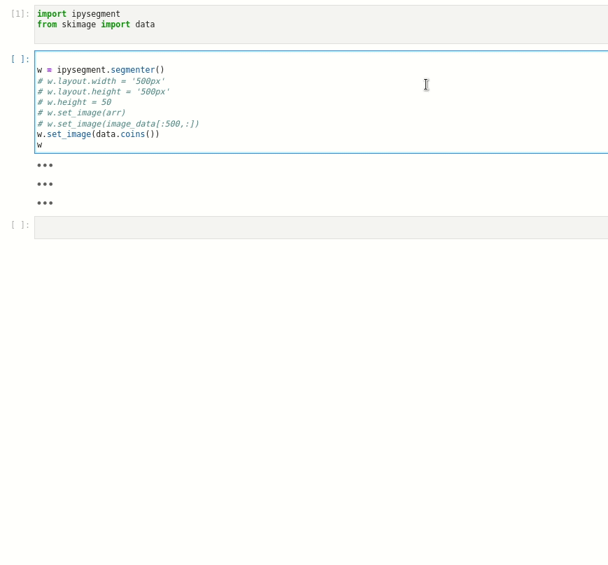

Now on PyPi!!
Still a little rough around the edges, but definitely usable at this point

Currently you can only control loading images or changing to erasing programmatically. PRs to add controls using ipywidgets very welcome :)

## Controls
 - left click to lasso
 - right/middle click to pan
 - scroll to zoom


 
# ipysegment

[](https://travis-ci.org//ipysegment)
[](https://codecov.io/gh//ipysegment)


manual image segmentation in jupyter

## Installation

You can install using `pip`:

```bash
pip install ipysegment
```

If you use jupyterlab make sure you have installed jupyterlab-manager

```bash
conda install -c conda-forge nodejs=12
jupyter labextension install @jupyter-widgets/jupyterlab-manager
```

If you are using Jupyter Notebook 5.2 or earlier, you may also need to enable
the nbextension:
```bash
jupyter nbextension enable --py [--sys-prefix|--user|--system] ipysegment
```


## Contributing

### Resources for learning how to make a jupyter widget
1. [official docs](https://ipywidgets.readthedocs.io/en/latest/examples/Widget%20Low%20Level.html)
    - you gotta scroll down to get to the good stuff. I would start at [widget skeleton](https://ipywidgets.readthedocs.io/en/latest/examples/Widget%20Low%20Level.html#Widget-skeleton)
2. [custom-ipwidget-howto](https://github.com/ianhi/custom-ipywidget-howto)
    - written by me so not super official
    - All the stuff I've figured out that isn't in the official docs - e.g. a complete(i hope) listing of all the methods availiable to widgets
3. [ipycanvas](https://github.com/martinRenou/ipycanvas)
    - general canvas widget for jupyter. Good source of inspiration for this extension

### Development Install

```bash
# First install the python package. This will also build the JS packages.
pip install -e ".[test, examples]"
```

When developing your extensions, you need to manually enable your extensions with the
notebook / lab frontend. For lab, this is done by the command:

```
jupyter labextension install @jupyter-widgets/jupyterlab-manager --no-build
jupyter labextension install .
```

For classic notebook, you can run:

```
jupyter nbextension install --sys-prefix --symlink --overwrite --py <your python package name>
jupyter nbextension enable --sys-prefix --py <your python package name>
```

Note that the `--symlink` flag doesn't work on Windows, so you will here have to run
the `install` command every time that you rebuild your extension. For certain installations
you might also need another flag instead of `--sys-prefix`, but we won't cover the meaning
of those flags here.

### How to see your changes
#### Typescript:
To continuously monitor the project for changes and automatically trigger a rebuild, start Jupyter in watch mode:
```bash
jupyter lab --watch
```
And in a separate session, begin watching the source directory for changes:
```bash
npm run watch
```

After a change wait for the build to finish and then refresh your browser and the changes should take effect.

#### Python:
If you make a change to the python code then you will need to restart the notebook kernel to have it take effect.
